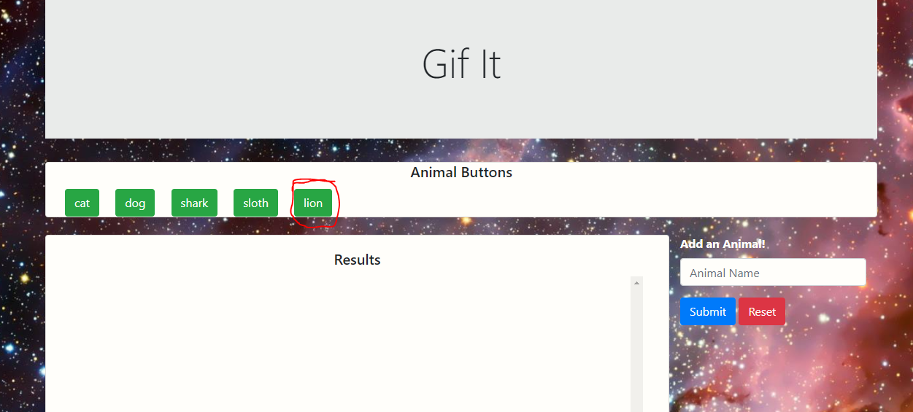

# Gif-It

A fun to use gif search app focused on animals.

## Overview

Gif-It allows the user to add any animal they want to the already existing animal buttons. Once the animal has been added the user can get a list of gifs with a click of a button.

## Instructions

1. Navigate to the page for the app using the link below or at the bottom of this README.    
* https://ericvincitore.github.io/Gif-App/

2. The user should be redirected to the following page.  

3. The user can add an animal to the list of buttons using the input box and clicking submit.  

* Before Submit    

* After Submit  

4. The user can then click an animal button to generate a list of gifs. They can play and pause the gifs by clicking the gif.

## Links

### Deployed App Page
 
https://ericvincitore.github.io/Gif-App/

### Git-Hub Page

https://github.com/EricVincitore/Gif-App

## Technologies Used

* HTML5
* Bootstrap
* Javascript
* AJAX

## Development Role

This app was developed by Eric Vincitore.